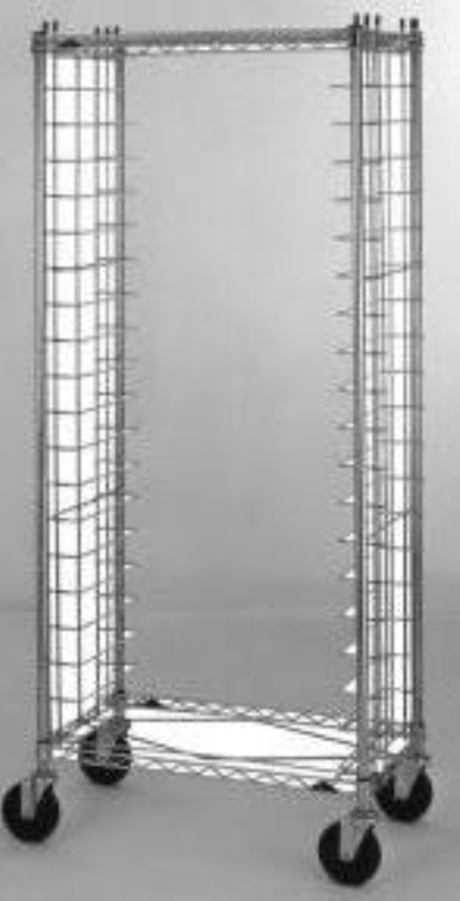

# stereo-robot

<div id="top"></div>


<!-- PROJECT LOGO -->
<br />
<div align="center">
  
  
<h3 align="center">StereoRobot</h3>

  <p align="center">
    Autonomous navigation using a stereo camera
    <br />
    <a href="https://stereo-robot.readthedocs.io/"><strong>Read The Docs »</strong></a>
    <br />
    <a href="https://github.com/nickthorpie/stereo-robot/issues/tree/main/docs/papers">Read the Papers</a>
    .
    <a href="https://github.com/nickthorpie/stereo-robot">Report Bug</a>
    ·
    <a href="https://github.com/nickthorpie/stereo-robot/issues">Request Feature</a>
  </p>
</div>


<!-- TABLE OF CONTENTS -->
<details>
  <summary>Table of Contents</summary>
  <ol>
    <li>
      <a href="#about-the-project">About The Project</a>
      <ul>
        <li><a href="#built-with">Built With</a></li>
      </ul>
    </li>
    <li>
      <a href="#getting-started">Getting Started</a>
      <ul>
        <li><a href="#prerequisites">Prerequisites</a></li>
        <li><a href="#installation">Installation</a></li>
      </ul>
    </li>
    <li><a href="#usage">Usage</a></li>
    <li><a href="#roadmap">Roadmap</a></li>
    <li><a href="#contributing">Contributing</a></li>
    <li><a href="#license">License</a></li>
    <li><a href="#contact">Contact</a></li>
    <li><a href="#acknowledgments">Acknowledgments</a></li>
  </ol>
</details>


<!-- ABOUT THE PROJECT -->
## About The Project


This project is the backend for an autonomous warehouse solution built for [SigmaPoint](https://www.sigmapoint.com). 
This project uses a stereo depth camera connected to a Raspberry Pi to perform object detection,
line following, and QR code scanning. See the paper linked at the top to learn more about the design.

<p align="right">(<a href="#top">back to top</a>)</p>

### Project Background
Our client approached us to design a solution to atonomously move ULINE racks from one place to another in a factory environment.

The solution needed to operate safely and efficiently, with attention to scalability. We identified three main subsystems that the robots sensors must address:
- Local navigation (how does it navigate through a corridor)
- Global navigation (how does it know which turns to take)
- Collision avoidance (how does it avoid obstacles)

To ensure scalability, we considered that active sensors such as lidar should be ruled out. We decided a computer vision
solution could address scalability issues and fulfill the requirements for each subsystem. The system addresses the subsystems
in the following ways:
1. **Local Navigation: Line following** \
   The robot uses traditional computer vision techniques to identify a line, and follow it along corridors.
2. **Global navigation: QR Checkpoints** \
   The yellow tape is set up in a grid pattern throughout the factory. A QR code is placed at every intersection,
   and the camera reads it to update its current location and compare it with an internally stored map.
3. **Collision Avoidance: Stereo Vision** \
   The stereo camera is used to calculate a depth map using traditional stereo mapping techniques. A simple
   histogram technique identifies the obstacles and the robot is repelled from them accordingly.
   
<p align="right">(<a href="#top">back to top</a>)</p>

### Project Motivation
The project was initially conceived with modern machine learning techniques in mind. We hoped to use a GPU equipped microprocessor
such as the Jetson Nano, however the post-pandemic microprocessor shortage forced us to use a Raspberry Pi 4 for prototyping.
As such, I worked hard to create a backend that could achieve CV based navigation using dramatically less processing power.
I am continuing to restructure the current project to build out plug-and-play modularity as machine learning models get smaller and 
GPU availability returns to normal.


<p align="right">(<a href="#top">back to top</a>)</p>

### Roadmap

- [x] Camera Processing
    - [x] Line identification
    - [ ] Depth Processing
    - [x] QR Reader
- [ ] Navigation
    - [x] Vector Force Field
    - [ ] Node Container
    - [ ] A*
- [ ] GUI
    - [x] Line Following
        - [x] Thresholding
        - [x] ROI Selection
    - [ ] Connected Nodes builder
    - [x] Movement Calibration
        - [x] Sabertooth Calibration
- [ ] Project Structure
    - [ ] Config Module
    - [x] Multiprocessing Framework
- [ ] User Documentation
    - [x] Software installation 
    - [x] Wiring
    - [ ] Robot Build
        - [ ] Chassis Assembly
        - [ ] Engineering Drawings
    - [ ] Operation Manual
- [ ] Code Documentation
    - [x] main
    - [x] Camera Utilities
    - [ ] Direction Control
    
### Future Steps


<!-- GETTING STARTED -->
## Getting Started

TBD

### Prerequisites

This is an example of how to list things you need to use the software and how to install them.

* OpenCV
  ```
  pip install opencv-python
  ```

### Installation

Clone the repo
   ```sh
   git clone https://github.com/nickthorpie/stereo-robot.git
   ```


<!-- USAGE EXAMPLES -->
## Usage

See the [open issues](https://github.com/nickthorpie/StereoRobot/issues) for a full list of proposed features (and known issues).

<p align="right">(<a href="#top">back to top</a>)</p>


<!-- CONTRIBUTING -->
## Contributing

Contributions are what make the open source community such an amazing place to learn, inspire, and create. Any contributions you make are **greatly appreciated**.

If you have a suggestion that would make this better, please fork the repo and create a pull request. You can also simply open an issue with the tag "enhancement".
Don't forget to give the project a star! Thanks again!

1. Fork the Project
2. Create your Feature Branch (`git checkout -b feature/AmazingFeature`)
3. Commit your Changes (`git commit -m 'Add some AmazingFeature'`)
4. Push to the Branch (`git push origin feature/AmazingFeature`)
5. Open a Pull Request

<p align="right">(<a href="#top">back to top</a>)</p>


<!-- LICENSE -->
## License

Distributed under the MIT License. See `LICENSE.txt` for more information.

<p align="right">(<a href="#top">back to top</a>)</p>


<!-- CONTACT -->
## Contact

Nick Thorpe -  - nickthorpie@gmail.com

Project Link: [https://github.com/nickthorpie/stereo-robot](https://github.com/nickthorpie/stereo-robot)

<p align="right">(<a href="#top">back to top</a>)</p>


<!-- ACKNOWLEDGMENTS -->
## Acknowledgments

* []()
* []()
* []()

<p align="right">(<a href="#top">back to top</a>)</p>


<!-- MARKDOWN LINKS & IMAGES -->
<!-- https://www.markdownguide.org/basic-syntax/#reference-style-links -->
[contributors-shield]: https://img.shields.io/github/contributors/nickthorpie/StereoRobot.svg?style=for-the-badge
[contributors-url]: https://github.com/nickthorpie/StereoRobot/graphs/contributors
[forks-shield]: https://img.shields.io/github/forks/nickthorpie/StereoRobot.svg?style=for-the-badge
[forks-url]: https://github.com/nickthorpie/StereoRobot/network/members
[stars-shield]: https://img.shields.io/github/stars/nickthorpie/StereoRobot.svg?style=for-the-badge
[stars-url]: https://github.com/nickthorpie/StereoRobot/stargazers
[issues-shield]: https://img.shields.io/github/issues/nickthorpie/StereoRobot.svg?style=for-the-badge
[issues-url]: https://github.com/nickthorpie/StereoRobot/issues
[license-shield]: https://img.shields.io/github/license/nickthorpie/StereoRobot.svg?style=for-the-badge
[license-url]: https://github.com/nickthorpie/StereoRobot/blob/master/LICENSE.txt
[linkedin-shield]: https://img.shields.io/badge/-LinkedIn-black.svg?style=for-the-badge&logo=linkedin&colorB=555
[linkedin-url]: https://linkedin.com/in/linkedin_username
[product-screenshot]: resources/readme/pybulletscreencap.png
