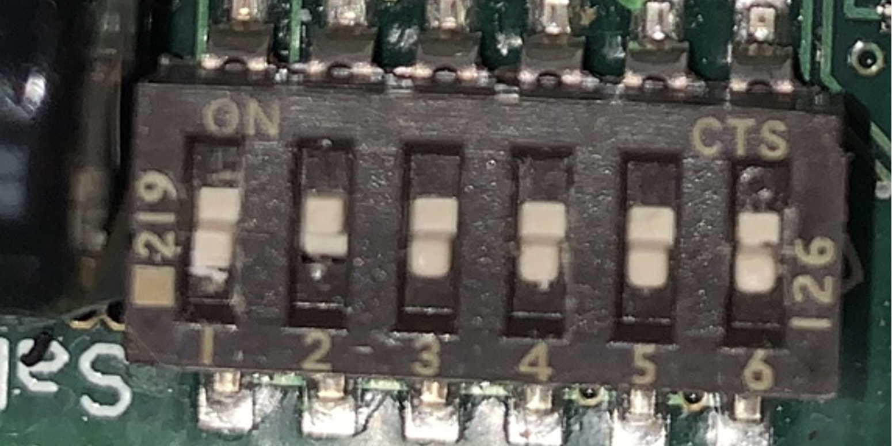
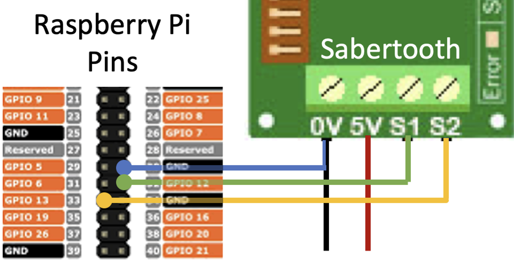
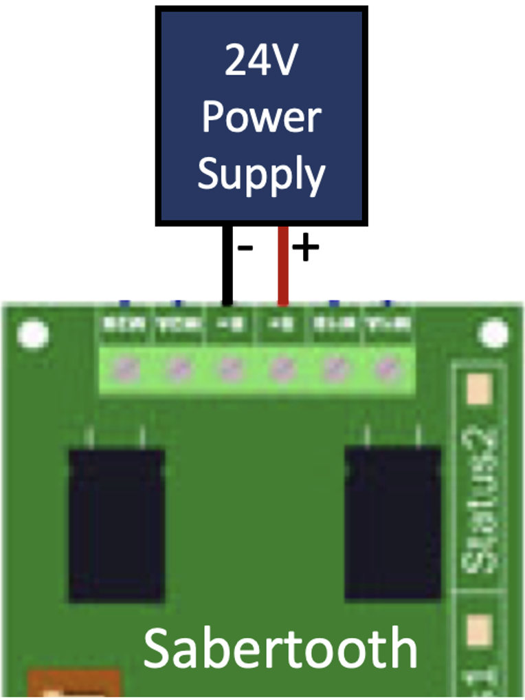
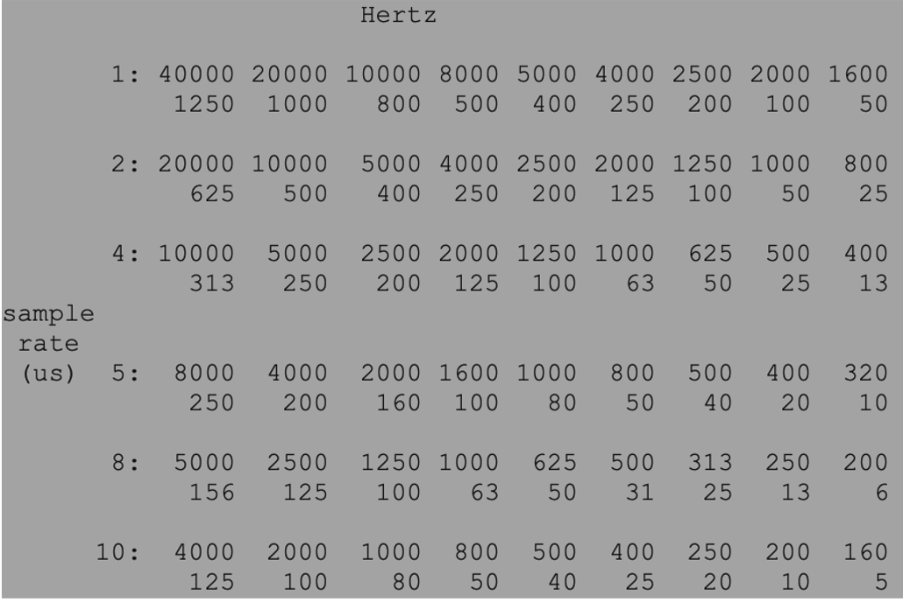
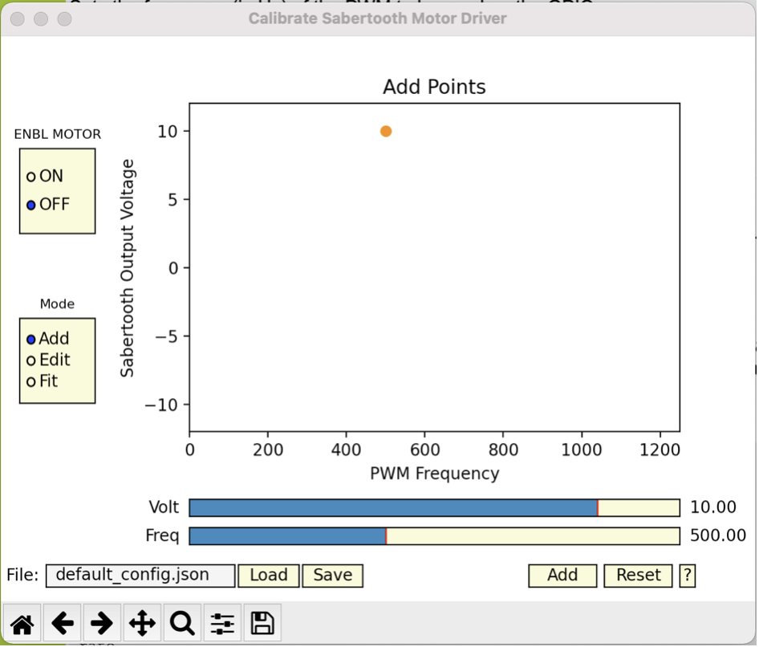
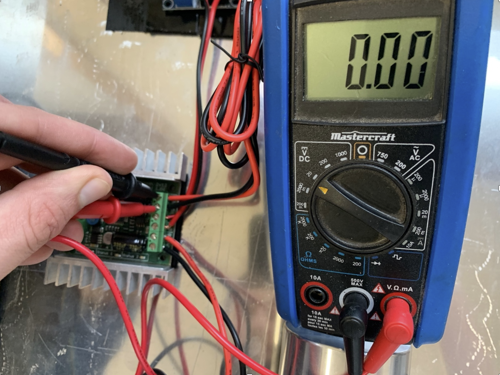
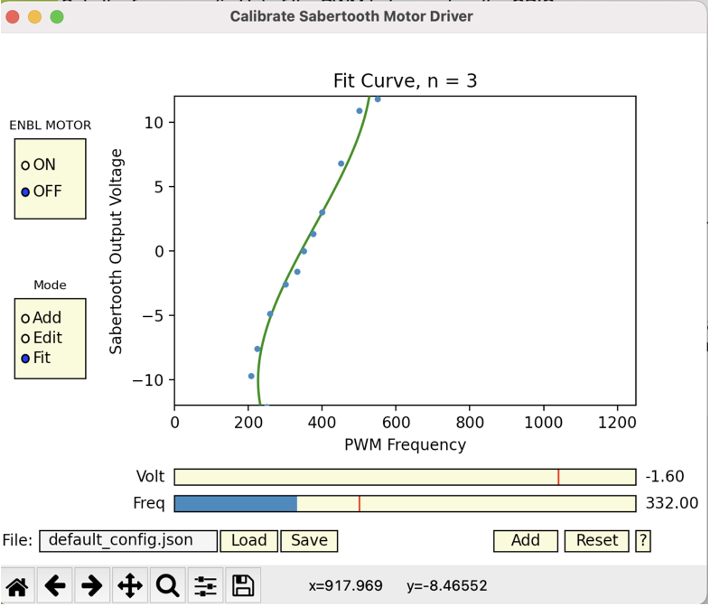

********************************
Sabretooth Setup and Calibration
********************************

1.0 Hardware and Wiring
-----------------------

**1.1 Switches**
The Sabertooth Dual 12A 6V-24V Regenerative Motor Driver offers a suite of options to control the motors. Although any of these options should theoretically work, the following setup was used, where all switches are in the up position except for switch 2.

This puts the controller in RC, independent mode. RC mode means the direction and magnitude of each wheel is controlled by the frequency of the pwm signal. 

Note on RC Vs analog mode:
Analog mode is a more rigorous option, however the voltage output of the raspberry pi ranges 0-3.3V, whereas the sabretooth expects 0-5.0V. There may be workarounds to avoid RC mode, however this was what is used for the purpose of this project.

**1.2 Wiring**

The raspberry pi only supports 2 dedicated PWM channels, on GPIO 12 and GPIO 13.
Connect the sabretooth S1 and S2 to those respective pins, and 0V to the ground. At this point, you may prepare the cord that charges the RPi power supply. Prepare a micro usb by cutting and stripping the +ve and -ve wire. Twist the raw end of the raspberry pi ground wire with the -ve micro usb wire, and insert into the sabretooth 0V while inserting the +ve wire into the 5V.

Connect the sabretooth B- and B+ to the 24 V power supply. **ENSURE THE SABERTOOTH IS PROPERLY INSULATED FROM THE CHASSIS OF THE ROBOT BEFORE CONNECTING THE POWER SUPPLY.**

If the error light turns on, the power supply may be supplying too much voltage. Consider using a buck converter to step down the voltage.

2.0 Software Setup
------------------
To collect the sabertooth’s mapping from pwm frequency to output voltage, we sample the voltage output of several different frequencies. Before starting the sabretooth calibration GUI, open a terminal and enter the following command to start the pigpio daemon.

 | sudo pigpiod -t 1

DEVELOPPER NOTE:
Pigpiod only allows a discrete set of frequencies, corresponding to the sample rate set by the “-t” flag. For a list of frequencies available for each sample rate, see:

Before calibration, we are not certain what frequency corresponds to a stopped motor. If you cannot pinpoint the exact frequency, you may consider using a different sample rate.

With the stereo-robot library downloaded, run the python script  
 | stereo_robot>calibration>CALIB_sabertooth_GUI.py

3.0 Calibration
---------------

After opening the sabretooth GUI, there are several functionalities to note.

1. Set ENBL MOTOR to “ON” 

2. With a voltmeter across the M1A and M1B leads, start adjusting frequencies. Note that the output voltage should change as the frequency changes. 

3. Adjust the frequency such that the voltage is 0
4. Sample Voltages
 a. At a given frequency, measure the output voltage with the voltmeter. 
 b. With the up/down arrows, adjust the GUI’s orange point to the measured voltage. 
 c. Press enter to sample the point
 d. Repeat for a variety of frequencies around the 0 point. (Note that the sabretooth has an operating range, and frequencies that are too far away from the zero point have undefined voltages
5. To delete points, you can enter the edit mode, and use the left/right arrows to select the point. Press backspace to delete the point
6. Fit the curve.
 a. Press enter to show the curve
 b. Use the left/right arrow to increase/decrease the degree of the curve
 c. Select a degree that accurately follows the sampled points. Ensure that the line passes through the point that corresponds to zero voltage. You may need to sample more points around the zero point to achieve this.
7. Press “Save” to save these points to a configuration file. If the filename is default_config.json, the default will not be overwritten, instead writing to config.json.

